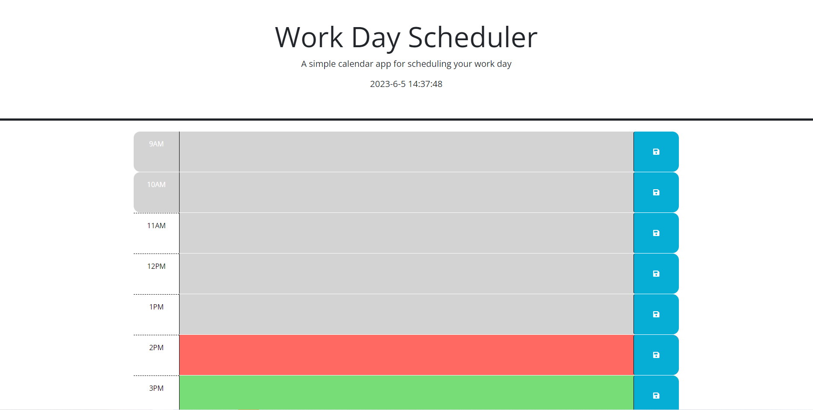

# Challenge05
This is my submission for challenge five during my coding bootcamp through UT Austin.
I was tasked with adding javascript functionality to a simple workday planner.
These functions were adding a local storage option to save data given by the user, add reactive styling to each hour block depending on the time of day, and having the date and time appear on the top of the site.

Deployed Application: 

.png)

